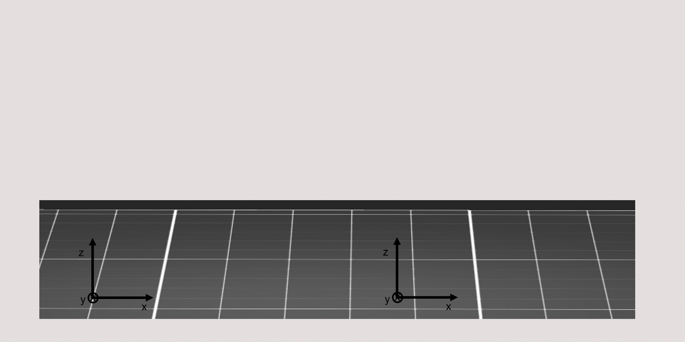
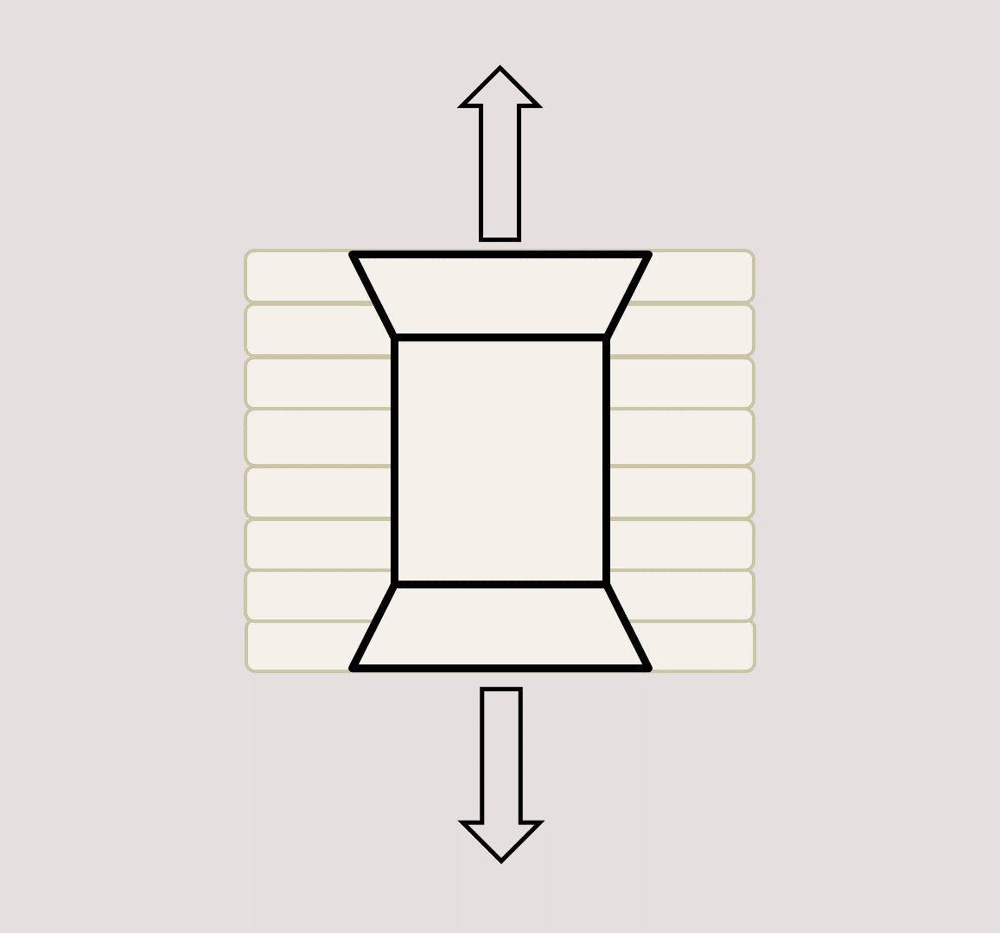
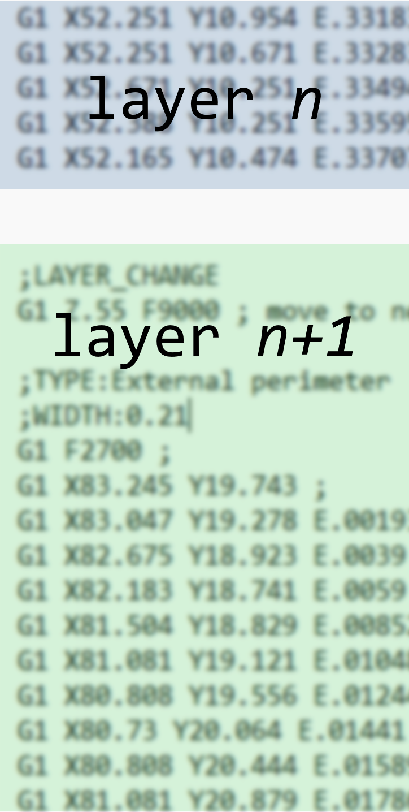
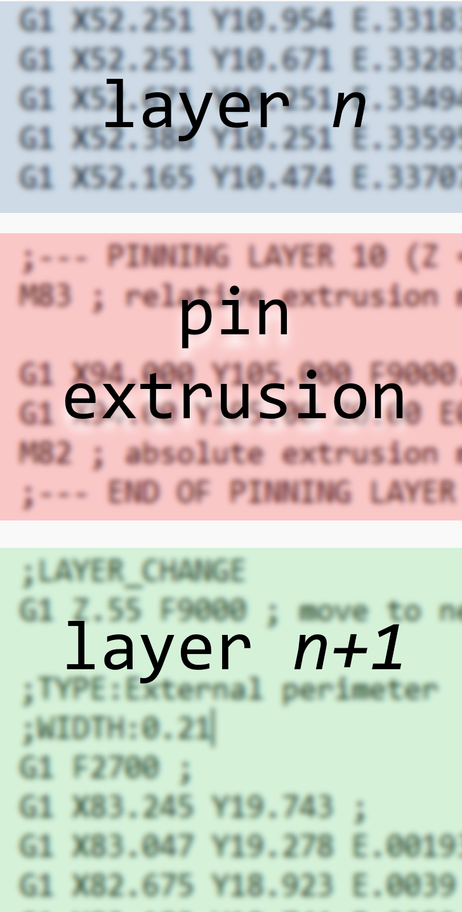
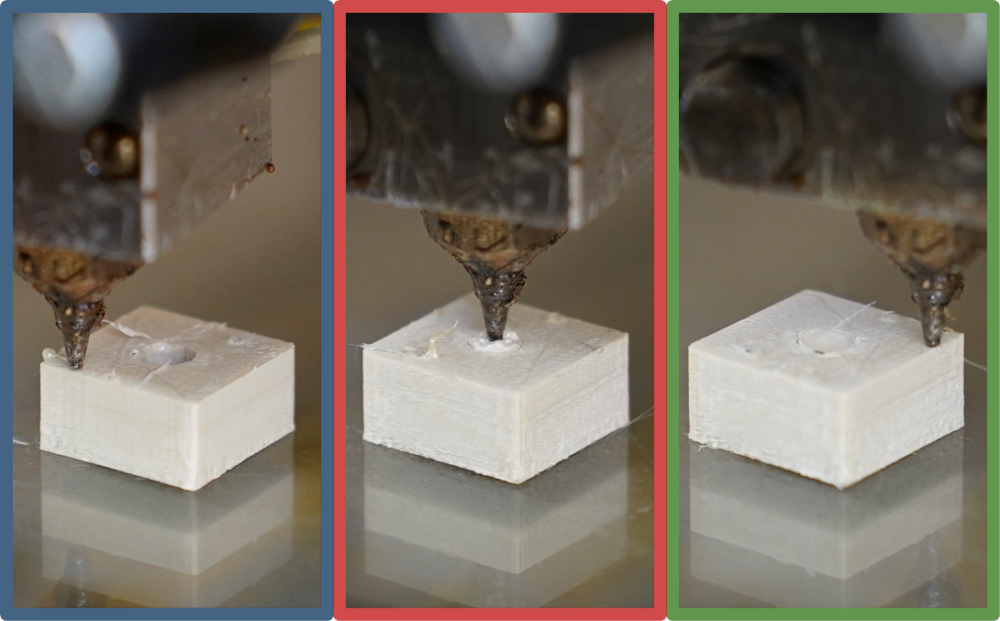

# G-code Post-Processor for Z-Pinning — Improving Interlayer Strength in FDM Printed Parts

A Python tool that post-processes slicer-generated G-code to insert **z-pin extrusion movements** into FFF 3D-printed specimens during the print. Note: this tool does not create the pin cavities in the part geometry — that step must be done beforehand in CAD or slicer (see [Quick Start](#quick-start)). Developed as part of a Master's thesis at Delft University of Technology, [Shaping Matter Lab](https://www.tudelft.nl/lr/organisatie/afdelingen/aerospace-structures-and-materials/shaping-matter-lab).

---

## What is Z-Pinning for FFF?

Fused filament fabrication (FFF) produces parts with inherently anisotropic mechanical properties: strength and stiffness along the filament direction are significantly higher than across the layers, where weak adhesion and voids cause premature failure. This limitation is especially pronounced with highly anisotropic, shear-aligning materials such as fiber-filled filament grades, where the in-plane properties benefit greatly from molecular or fiber alignment during extrusion, but rapid post-extrusion cooling restricts interlayer diffusion.

Inspired by through-thickness reinforcement strategies in traditional composite laminates, and building on the foundational research into z-pinning for FFF by Duty, Kim, Bales, Nasirov et al. (ORNL/University of Tennessee, 2017–2023), this project adapts z-pinning to FFF. During printing, the slicer intentionally leaves vertical cavities in the specimen cross-section. At predefined layers, the nozzle dives into the deposited material and extrudes additional filament, forming **continuous vertical pins** that bridge multiple layers. The result is a part in which discrete pins act as through-thickness reinforcement, mechanically interlocking the horizontal layers without requiring post-processing steps or different materials.

<p align="center">
  <br/>
  <em>Traditional layer-by-layer material deposition (left) and cross-layer deposition introducing z-pins (right).</em>
</p>

Key characteristics of the approach:
- **Designed for airbrush nozzle printing** — the diving strategy requires a nozzle that can enter the cavity; the tool was developed for an airbrush-type nozzle geometry.
- **In-situ reinforcement** — pins are formed during the regular print cycle, no extra hardware needed.
- **Mechanical interlocking** — the primary strengthening mechanism; pins infiltrate the gaps between layer-infill lines as extrusion overflows the cavity walls.
- **Configurable geometry** — pin diameter, height, number and grid distribution within the cross-section, and rivet shape (lower cone → cylinder → upper cone) are all parameterised. Pins are arranged in a **regular grid** within the specimen cross-section.
- **Staggered layout** — adjacent pin columns start at offset layers to eliminate aligned seams (weak points) in the load path.

<p align="center">
  <br/>
  <em>When loaded across the printing plane, z-pins with rivet geometry bridge interlayer cracks.</em>
</p>

The tool was developed and validated for **Vectra® A950 LCP filament** (HBA:HNA copolymer, manufactured by [NematX AG](https://nematx.com/)) printed on a **modified Ultimaker 2+** with an **E3D Hemera extruder system** running **[Klipper](https://www.klipper3d.org/) firmware**, sliced with **[SuperSlicer](https://superslicer.net/)**.

---

## How It Works

The post-processing pipeline consists of three logical steps that run in sequence each time a configuration script is executed.

### Step 1 — Pin layout definition

The cross-section geometry and pin layout are defined by the user in a configuration script (see [configs/template.py](configs/template.py)). From this, the pin positions within the specimen cross-section are calculated and validated: the tool checks that all pins fit inside the cross-section boundary and prints the resulting infill percentage for reference.

### Step 2 — G-code generation

For each layer in the specimen height, the tool determines whether a pinning action is required based on the staggered pinning schedule. When it is, it generates the full sequence of G-code commands for that layer: travel moves to each pin location (with Z-hop and retraction), the nozzle dive into the deposited material, the pin extrusion with the configured profile (variable extrusion, rivet shaping, wipe), and the return to safe travel height. The result is a dictionary mapping each layer number to its pinning G-code.

### Step 3 — G-code injection

The tool reads the base `.gcode` file produced by the slicer and inserts the pinning commands at the correct layer boundaries, identified by the `;LAYER_CHANGE` comment. A header block listing all active parameters is also written into the file for traceability. The modified file is saved to `gcode_output/` with a filename that encodes the configuration.

### Pin extrusion review (`pin_extrusion_review/`)

Each run also writes a CSV file to `pin_extrusion_review/` containing the exact sequence of G-code commands executed for a single pin extrusion (all pins in a run are identical, so only one representative sequence is saved). The CSV is named to match the output G-code file for traceability. Its purpose is to let you inspect and tune the extrusion strategy — Z position, extrusion amount, feedrate — move by move, without having to open the full G-code file. Open it in any spreadsheet application alongside the parameter settings in your configuration script.

<table>
  <tr>
    <td align="center"></td>
    <td align="center"></td>
    <td align="center"></td>
  </tr>
  <tr>
    <td colspan="3" align="center"><em>(a) Slicer G-code input, (b) post-processed G-code with injected pinning directives at layer boundaries, and (c) the nozzle during the three phases of a pinning sequence.</em></td>
  </tr>
</table>

---

## Repository Structure

```
z-pinning-gcode-post-processor/
├── pin_layout.py                    # Step 1: validates and places pins in the cross-section
├── pin_gcode_generator.py           # Step 2: generates per-layer pinning G-code
├── gcode_injector.py                # Step 3: splices the pinning G-code into the base file
├── configs/
│   ├── template.py                  # Annotated configuration template — start here
│   └── .../                         # Specimen-specific configuration scripts
├── gcode_input/
│   ├── template.stl                 # Reference STL: specimen with pre-modelled pin cavities
│   └── template.gcode               # Reference input: slicer G-code for the template specimen
├── gcode_output/
│   └── template_phl28_dv_sk0.1_ve200_wp_1.2.gcode   # Reference output: post-processed G-code
├── pin_extrusion_review/            # Output: per-run CSV of pin extrusion commands (see below)
├── assets/                          # Images and GIFs used in this README
└── requirements.txt                 # Python dependencies
```

---

## Requirements

Python 3.8 or newer.

```bash
pip install -r requirements.txt
```

Dependencies: `numpy`, `matplotlib`, `pandas`, `scipy`.

---

## Quick Start

> **Reference files included:** `gcode_input/template.stl`, `gcode_input/template.gcode`, and `gcode_output/template_phl28_dv_sk0.1_ve200_wp_1.2.gcode` are provided as a worked example. Open the STL in your CAD tool to see how pin cavities should be modelled, run `configs/template.py` to reproduce the output G-code, and open the output in a G-code viewer to see what a correctly post-processed file looks like before attempting your own specimen.

### 1 — Prepare the part geometry and generate the base G-code

**Before slicing**, the part CAD model must be modified to include the **pin cavities**: circular holes placed at the desired pin locations, spanning the full pin height. This step is not handled by this tool — use your CAD software or slicer of choice to embed the cavities in the geometry. See `gcode_input/template.stl` for a reference specimen with pre-modelled cavities.

Once the model is ready, slice it in any FFF slicer and export the `.gcode` file to `gcode_input/`. This is where all configuration scripts look for input files.

> **Slicer compatibility note:** the post-processor detects layer boundaries by matching the comment `;LAYER_CHANGE` in the G-code. This comment is emitted by **[SuperSlicer](https://superslicer.net/)** and **PrusaSlicer**. If you use a different slicer, update that string in `gcode_injector.py` to match your slicer's layer-change marker before running.

The G-code filename must contain the stem of your configuration script (see step 2).

### 2 — Create a configuration script

Copy the annotated template and rename it to match your G-code file:

```bash
cp configs/template.py configs/my_specimen.py
```

Edit `my_specimen.py` to set:
- **Specimen geometry** — cross-section dimensions and height
- **Pin layout** — diameter, count, centre-to-centre spacing, height
- **Part positions** — XY coordinates and rotation on the build plate
- **Printing parameters** — flow ratio, speeds, nozzle behaviour

Every parameter is documented inline in [configs/template.py](configs/template.py).

### 3 — Run the post-processor

```bash
python -m configs.my_specimen
```

The post-processed G-code is written to `gcode_output/` with a filename that encodes the active parameters (e.g. `template_phl28_dv_sk0.1_ve200_wp_1.2.gcode`).

### 4 — Verify in a G-code viewer

**Always inspect the output in a G-code viewer** (e.g. [Gcode Viewer](https://www.gcodeviewer.com/) or the preview built into your slicer) before printing. The post-processor has no feedback loop — it cannot detect collisions or out-of-bounds moves. Pinning movements will appear as **travel moves** in the viewer; check that they land at the correct XY positions and Z depths. Open `gcode_output/template_phl28_dv_sk0.1_ve200_wp_1.2.gcode` to see a reference example of what correctly injected pinning G-code looks like.

---

## Key Parameters

| Parameter | Description |
|-----------|-------------|
| `pin_center_distance_x` | Centre-to-centre spacing between adjacent pins along the larger cross-section axis (mm) |
| `pin_center_distance_y` | Centre-to-centre spacing between adjacent pins along the smaller cross-section axis (mm) |
| `pin_diameter` | Pin diameter for circular pins (mm); constrained by nozzle taper geometry |
| `pin_height_layers` | Pin height in slicer layers |
| `num_pins_largest_side` / `num_pins_smallest_side` | Number of pins distributed in a regular grid along each cross-section axis |
| `flow_ratio` | Extrusion multiplier (e.g. `1.65` = 165 % of theoretical volume; over-extrusion is required for cavity filling and mechanical interlocking) |
| `diving_mode` | `True` = nozzle dives into previous layers; `False` = builds from top surface |
| `nozzle_sinking` | Extra depth the nozzle sinks below the layer surface (mm) |
| `variable_extrusion_enabled` | Ramp extrusion rate along pin height |
| `extrusion_skew_percentage` | Peak/base extrusion ratio (100 = uniform; 200 = doubles at tip) |
| `geometrical_extrusion_enabled` | Shape pin as a rivet: lower cone → cylinder → upper cone |
| `stagger_params` | Offset the start layers of adjacent pin columns to eliminate aligned seams |

---

## Output Filename Convention

The post-processed G-code filename encodes the configuration:

```
{original_name}_phl{N}_{mode}_sk{sinking}skw{wait}_ve{skew}_wp_{flow_ratio}.gcode
```

| Token | Meaning |
|-------|---------|
| `phl28` | Pin height = 28 layers |
| `dv` / `top` | Diving / top mode |
| `sk0.1` | Nozzle sinking = 0.1 mm |
| `skw0` | Sinking wait time = 0 s |
| `ve200` | Variable extrusion at 200 % |
| `wp` | Wipe enabled |
| `1.20` | Flow ratio |

---

## Citation and References

This tool was developed as part of a Master's thesis in Aerospace Engineering at Delft University of Technology:

> L. Onorato, *"Z-Pinning of Fused Filament Fabricated Liquid Crystal Polymer Specimens"*, MSc thesis, Delft University of Technology, 2025. Available at the [TU Delft repository](https://repository.tudelft.nl/record/uuid:16f46bb7-3250-47b1-9c52-1ec65722701d).

The z-pinning concept builds on foundational work by Duty et al.:

> C. Duty, J. Failla, S. Kim, J. Lindahl, B. Post, L. Love, V. Kunc, *"Reducing Mechanical Anisotropy in Extrusion-Based Printed Parts"*, Proceedings of the 28th Annual International Solid Freeform Fabrication Symposium, 2017. [Link](http://utw10945.utweb.utexas.edu/sites/default/files/2017/Manuscripts/ReducingMechanicalAnisotropyinExtrusionBased.pdf)

---

## Contact

If you would like to discuss the project, ask about the implementation, or give feedback, feel free to reach out via [LinkedIn](https://www.linkedin.com/in/lorenzo-onorato).
